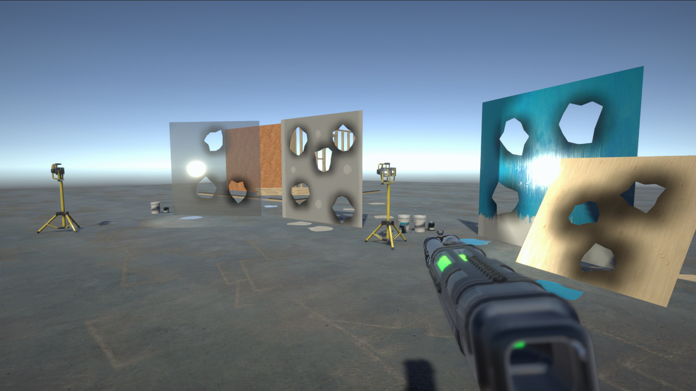

# Real-time mesh cutting using projection and Ear Clipping triangulation

    <h2>In this project I created tools that allow for real-time mesh cutting 
    using projection and Ear Clipping, UV interpolation and decal application to create an interactive and immersive experience.</h2>
    <h3>For more details go to 'Wiki'.</h3>

